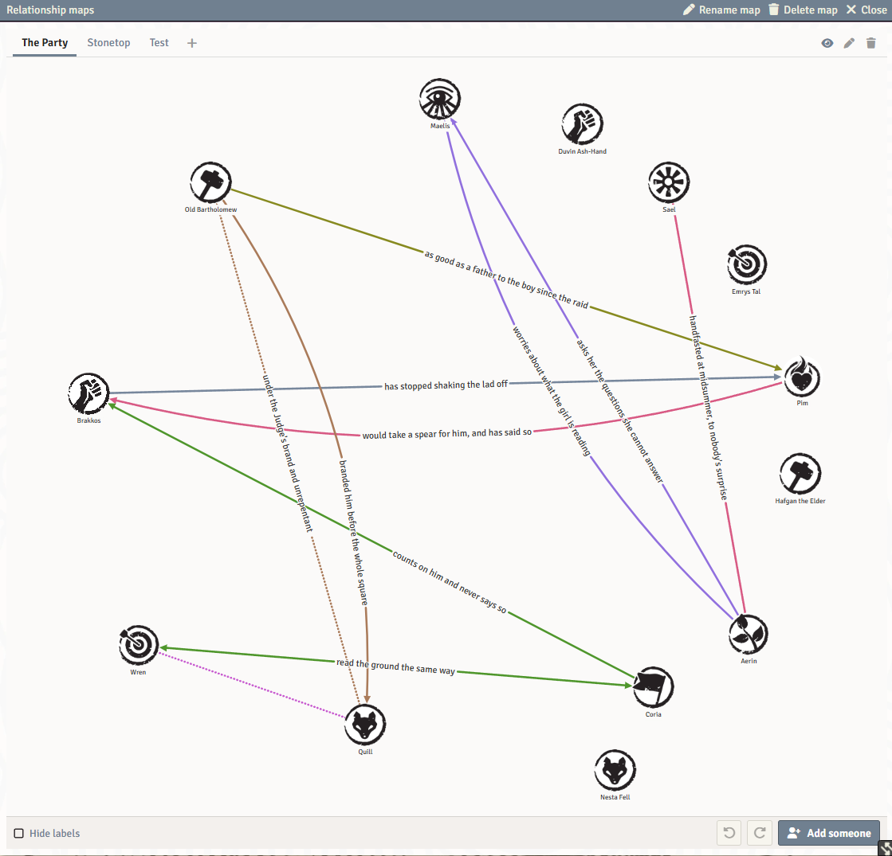
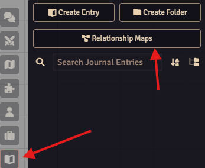

# Relationship Map - by PWD

A shared board of who knows whom, for [Foundry Virtual Tabletop](https://foundryvtt.com). Put your characters and NPCs on it as portraits, draw curved, labelled, coloured lines between them, and arrange it together: every player can draw on a map they can see, and every change reaches the whole table at once.

It works with any game system.



## Features

- **Collections of maps.** A world can hold several collections, and each collection can hold several named maps ("The Court", "The Docks", "Who owes whom"). Each map has its own people, its own lines and its own layout, and the same person can stand on more than one. Nothing is made for you: every collection and every map in it is one somebody added.
- **Drawn together.** Every player who can see a map can move people and draw lines on it. Changes are saved to the world and appear on everyone's screen straight away.
- **Hidden until shown.** A new map starts out as the GM's own. The GM shows it to the players with the eye on the strip of map tabs when it is ready.
- **Lines that say something.** Click a line to write on it and choose its colour, which way it reads (one way, both ways, or neither), whether it is solid, dashed or dotted, and how big its words are. There are eight named colours, forty more in the palette, and colours of your own. The next line you draw in a collection starts out in the pen you last used there.
- **A map that grows with its cast.** The map pans and zooms, grows as people are added, and keeps its captions clear of the faces and of each other. Rest on a face to light up that person's whole web.
- **Undo and redo** for your own changes on a map (Ctrl+Z, Ctrl+Shift+Z), never anybody else's.
- **Drawn for your eyes.** Three dials under the map make arrowheads, lines and words heavier or lighter for you alone, and a checkbox hides the captions. A client setting draws every map in high contrast, with a dash pattern per colour so colour is never the only thing telling two lines apart.
- **Light and dark.** Follows Foundry's own light or dark setting for application windows.
- **Out of the way.** Collections are kept out of the Journal sidebar list. A "Relationship Maps" button in the Journal sidebar opens the map you were last on, and map windows you leave open come back after a reload.

## Installation

In Foundry, open **Add-on Modules**, choose **Install Module**, and paste this manifest URL:

```
https://github.com/PrinceWitherdick/relationship-map-pwd/releases/latest/download/module.json
```

Then enable **Relationship Map - by PWD** in your world's module settings.

## Getting started

1. Open the **Journal** sidebar (the book tab) and press **Relationship Maps** at the top. In a world with no collection yet, you are asked what the first one is called.

   

2. Press **New map**, or the **+** beside the map tabs, to add a map to the collection.
3. Drag actors from the **Actors** sidebar onto the map, or press **Add someone** under it.
4. Drag from the small link handle on a portrait to another portrait to draw a line. Click the line to write on it and style it.
5. Right-click a portrait to take that person off the map. Double-click it to open their sheet.
6. Use the strip of tabs above the map to add, rename, reorder, hide and delete maps. Use **Collections** on the window's title bar to switch collections or make another.

### Who can do what

| | Player | Trusted Player | GM |
|---|---|---|---|
| See and draw on a map the GM has shown | Yes | Yes | Yes |
| Add, rename, reorder and delete maps in a collection | Yes | Yes | Yes |
| Make a new collection | No | Yes | Yes |
| Hide or show a map | No | No | Yes |
| Delete a whole collection | No | No | Yes |

Collections are ordinary journal entries owned by everyone at the table, which is what lets every player draw on their maps. Hidden maps are hidden from view, not encrypted: like anything hidden in Foundry, a determined player with the browser console can still read them.

### Settings

- **High-contrast relationship maps** (per user): stronger line colours, a dash pattern per colour, heavier rims.
- **Reopen relationship maps after a reload** (per user): on by default.

### For macros and other modules

```js
const api = game.modules.get("relationship-map-pwd").api;
api.open();              // the map you were last on
api.open("The Court");   // a collection by name or id
api.choose();            // pick a collection from a list
```

## Compatibility

Foundry VTT v13 and v14. No game system is required or assumed.

## Development

```
npm install
npm test
npm run lint
```

The tests run under [Vitest](https://vitest.dev) against the real templates and stylesheet, with small stand-ins for the Foundry globals.

## Credits

Built by PrinceWitherdick. The relationship map was first built for the [Stonetop system for Foundry VTT](https://github.com/PrinceWitherdick/stonetop-pwd) and has been rebuilt here as a module of its own. Created in collaboration with AI to facilitate quick development.

## License

The code is released under the [MIT License](LICENSE).
